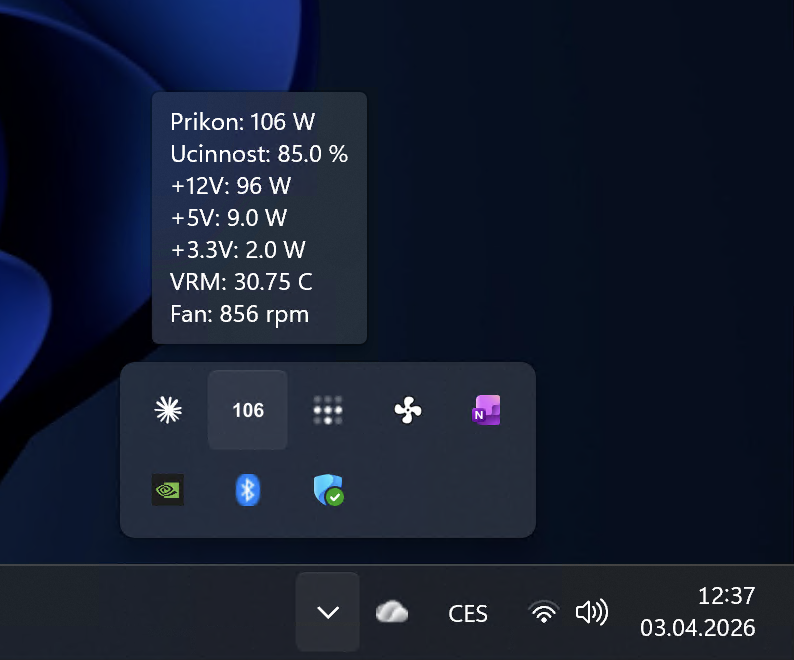

# rm1000i-tray

**Windows system-tray widget that shows live power draw from a Corsair RM1000i PSU — something iCUE doesn't expose.**




Reads wattage, rail voltages, efficiency, VRM temperature, and fan speed straight off the PSU over USB HID, using [liquidctl](https://github.com/liquidctl/liquidctl). Updates the tray icon every second. Tooltip shows everything. Icon turns red over 800 W — handy when tuning GPU undervolts or catching runaway transients.

## What the tooltip has

- Total power draw (W)
- Efficiency (%)
- Per-rail power: +12 V, +5 V, +3.3 V
- VRM temperature
- Fan speed

## Install

```powershell
git clone https://github.com/koprjaa/rm1000i-tray.git
cd rm1000i-tray
powershell -ExecutionPolicy Bypass -File install.ps1
```

The installer sets up autostart on login. **Close iCUE first** — it locks the USB HID device and this tool won't be able to open it while iCUE is running.

## Manual run

```bash
pythonw rm1000i-tray.py
```

`pythonw` instead of `python` so no console window appears.

## Works with

Any Corsair RMi / HXi series PSU that liquidctl supports (RM650i/750i/850i/1000i, HX750i/850i/1000i/1200i…). Tested daily on RM1000i.

## Failure behaviour

If a USB read hiccups, the tray keeps the last known value rather than flashing `??` — catches most transient read errors without user noise. A full disconnect triggers an auto-reconnect loop.

## License

[MIT](LICENSE)
